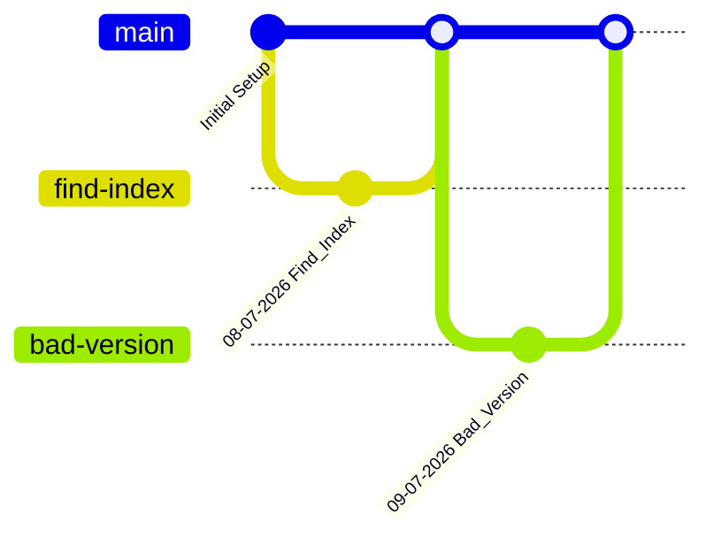

# 🚀 LeetCode Solutions & Git Sandbox

[](https://isocpp.org)
[](LICENSE)
[](https://leetcode.com)

A premium, organized repository dedicated to **daily practice, algorithmic consistency, and mastering version control workflow**. This project serves as a personal index of solved LeetCode challenges and an active sandbox for practicing production-grade Git branching.

---

## 🎯 Core Objectives

*   **Algorithmic Mastery** — Reinforcing core patterns (Two-Pointer, Binary Search, Sliding Window, Graphs).
*   **Deep Documentation** — Writing detailed execution breakdowns, not just raw code.
*   **Git Engineering** — Cultivating production-level branching and merging literacy.
*   **Unbroken Consistency** — Showing up daily, rain or shine, to solve 1–2 problems.

---

## 📂 Repository Structure

The project follows a strict **one-folder-per-question** architecture to maintain maximum isolation and readability:

```text
LeetCode-Solutions/
├── 1967-Number-of-Strings-That-Appear-as-Substrings-in-Word/
│   ├── ans.cpp
│   └── README.md
├── 28-Find-the-Index-of-First-Occurrence-in-a-String/
│   ├── ans.cpp
│   └── README.md
├── 278-First-Bad-Version/
│   ├── ans.cpp
│   └── README.md
└── README.md  🡠 (You are here)
```

### 📄 Inside Each Question Folder
Every sub-directory contains an explicit two-file ecosystem:
1.  `ans.cpp` — The fully tested C++ implementation.
2.  `README.md` — A structured write-up mapping out the solution:
    *   Problem Link & Difficulty Tier
    *   Formal Problem Statement
    *   Algorithmic Intuition & Approach
    *   Big-O Complexity Analysis ($Time \ \& \ Space$)
    *   Line-by-Line Code Walkthrough

---

## 🌿 Production Git Workflow

To avoid bad habits like direct pushing, this repo operates under a strict feature-branch workflow modeling real-world engineering teams:



### 🔄 The Routine
1.  **Branch Isolation** — Spawn a new branch for the targeted LeetCode problem.
2.  **Implementation** — Author the C++ solution and compile natively.
3.  **Strict Commit Format** — Commit changes using the specific date schema:
    ```bash
    git commit -m "DD-MM-YYYY Question_Name_Here"
    ```
4.  **Mainlining** — Safely merge the feature branch back into the main deployment line (`main`).

---

## 🛠️ Tech Stack & Requirements

*   **Language:** C++ (Standard template library heavily utilized)
*   **Compiler:** Modern GCC/Clang compiler supporting C++17 or higher (On LeetCode)
*   **Build Execution:**
    ```bash
    g++ -O3 -std=c++17 ans.cpp -o solution
    ./solution
    ```

---

## 📈 Current Progress

The codebase grows dynamically every single day. 

*Want to review an approach? Dive into any specific directory listed above to see the structural breakdown and Big-O efficiency profiles.*

---
<p align="center">
  Prepared with 💙 by Mayur B Gund, a developer pursuing continuous learning.
</p>
